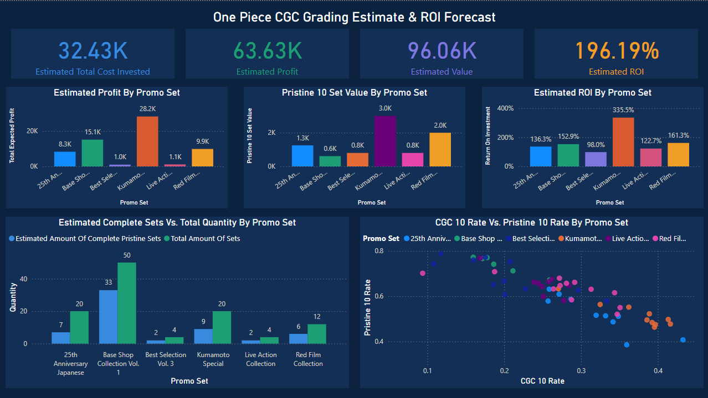
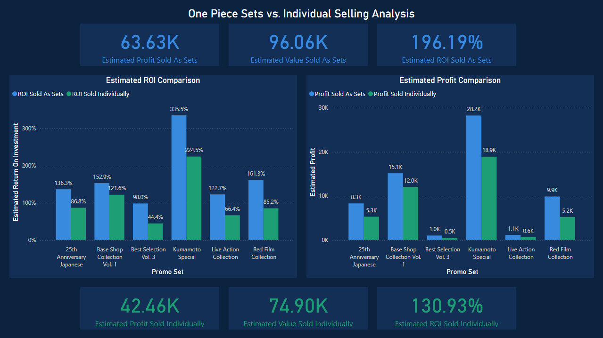

# One Piece Card Grading & ROI Model

A project where I modeled the expected return on buying and grading raw One Piece 
cards through CGC, then compared two ways of selling them: as complete sets vs. 
selling each card individually.

## Tools
Excel, Power BI

## What I did
- Bought raw cards from 6 different promo sets and used CGC's population report to 
  estimate each card's grading odds (Pristine 10, CGC 10, CGC 9, etc.) before sending 
  them in
- Built a cost and expected-value model in Excel to forecast profit for each set
- Built a Power BI dashboard to compare selling as complete sets vs. selling cards 
  individually
- Used the results to decide how much to invest in each set going forward

## Key findings
- Selling as complete sets beats selling individually on every set, $96K expected 
  value vs. $75K, a 28% difference, on a $32K investment
- Kumamoto Special had the best ROI (335%) thanks to a high CGC 10 rate
- Base Shop Collection got the largest quantity because 
  it had the best grading rate, which meant it was more reliable

## Dashboards

## Skills used
Data cleaning, probability/forecasting, Excel modeling, Power BI dashboards, 
ROI analysis
